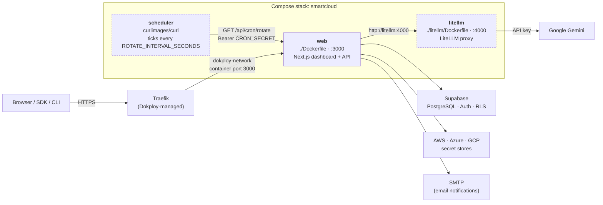

# Deploying on Dokploy (one Compose, three containers)

All containers deploy as a single Docker Compose stack, with all env set in one
place — the Compose app's **Environment** tab:

| Service | Build file | Port | Public | Purpose |
| --- | --- | --- | --- | --- |
| `web` | `./Dockerfile` | 3000 | yes | Next.js dashboard + API |
| `litellm` | `./litellm/Dockerfile` | 4000 | no | LiteLLM proxy → Gemini |
| `scheduler` | `curlimages/curl` image | — | no | Ticks key-pool rotation |

`docker-compose.yml` interpolates your Environment-tab values into the `${...}`
placeholders (used as **both** build args and runtime env). The worker stays private;
the app reaches it in-stack at `http://litellm:4000`.



Dashed containers are internal-only — they publish nothing and are unreachable
from outside the stack.

## Steps

1. **Create Service → Compose** — connect the repo/branch, Compose Path `docker-compose.yml`.
2. **Environment** tab — set once:
   ```env
   NEXT_PUBLIC_SUPABASE_URL=https://<ref>.supabase.co
   NEXT_PUBLIC_SUPABASE_ANON_KEY=<anon-key>
   NEXT_PUBLIC_APP_URL=https://your-domain.com
   SUPABASE_SERVICE_ROLE_KEY=<service-role-key>
   ENCRYPTION_MASTER_KEY=<64-hex>          # never change once secrets exist
   LITELLM_MASTER_KEY=<shared-secret>
   GEMINI_API_KEY=<gemini-key>
   CRON_SECRET=<random-secret>             # REQUIRED for key-pool rotation
   # optional: LITELLM_MODEL (default gemini/gemini-3.5-flash-lite),
   #           LITELLM_BASE_URL (default http://litellm:4000),
   #           ROTATE_INTERVAL_SECONDS (default 3600),
   #           ROTATE_URL (default http://web:3000/api/cron/rotate),
   #           SMTP_HOST/SMTP_PORT/SMTP_USER/SMTP_PASS/SMTP_SECURE/
   #           NOTIFY_EMAIL_FROM (email notifications)
   ```
3. **Domains** tab → Service Name `web`, Container Port `3000`, HTTPS + letsencrypt.
   This is also what attaches `web` to `dokploy-network` (see Notes).
4. **Supabase → SQL Editor** — run `supabase/migrations/001` → `009` in order
   (once per Supabase project; there is no auto-migrate step on deploy).
5. **Deploy.**
6. **Supabase → Auth → URL Configuration** → Site URL + Redirect URL
   `https://your-domain.com/auth/callback` (match `NEXT_PUBLIC_APP_URL`).

## Key-pool rotation needs the scheduler

Scheduled and risk-driven rotation are driven by periodic calls to
`GET /api/cron/rotate`. The `scheduler` service makes those calls in-stack
(`http://web:3000`), authenticating with `Authorization: Bearer $CRON_SECRET`.

- **`CRON_SECRET` is required.** Without it the endpoint returns 503, the
  scheduler logs `rotation is DISABLED` and idles, and only the manual
  "Rotate now" button does anything — every configured rotation interval and
  every "rotate on high risk" toggle silently never fires.
- **Interval:** `ROTATE_INTERVAL_SECONDS` (default `3600`, hourly). The endpoint
  is idempotent — a pool rotates only when its own interval has genuinely
  elapsed or its risk crossed its threshold — so this is a responsiveness knob,
  not a correctness one. Hourly means a risk spike is acted on within the hour
  while a "every 30 days" pool still rotates once a month.
- **Verify it:** `docker compose logs -f scheduler` should print a line per tick
  with `http=200` and a JSON summary (`checked`, `rotated`, `errors`).
- **Check it by hand:**
  ```bash
  curl -H "Authorization: Bearer $CRON_SECRET" https://your-domain.com/api/cron/rotate
  ```
- **Alternatives** — anything that can issue that authenticated request works:
  a systemd timer, Supabase `pg_cron` + `pg_net`, a GitHub Actions schedule, or
  Vercel Cron (`vercel.json`, retained for the Vercel deployment path only —
  it does nothing on Dokploy).

## Notes

- **Networking:** don't add `dokploy-network` to the compose file. Dokploy creates
  that network itself and attaches it (+ Traefik labels) to `web` automatically when
  you add the Domain in step 3. The compose's own `smartcloud` network handles
  web↔worker (`http://litellm:4000`). Declaring `dokploy-network: external` yourself
  causes `network dokploy-network ... could not be found` on any host where it doesn't
  already exist.
- **Ports:** the compose only `expose`s `3000`/`4000` — nothing is bound to the host.
  On Dokploy that is what you want: Traefik reaches `web` over `dokploy-network` on
  the Domain's Container Port, and publishing `3000` on the host would collide with
  other apps (`port is already allocated`). To run the stack locally instead, add
  `ports: ["3000:3000"]` under `web` (see the note at the bottom of the compose file).
- `NEXT_PUBLIC_*` are inlined at build time (build args) **and** read at runtime by
  server code — both come from the same Environment-tab values.
- A Compose stack redeploys all-or-nothing; changing any `NEXT_PUBLIC_*` needs a rebuild.
- Pin the worker image for production: replace `main-stable` in `litellm/Dockerfile`
  with a version tag (e.g. `:v1.90.2-stable`).
