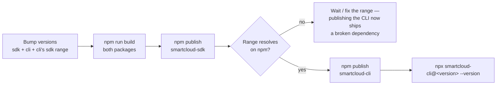

# Publishing the SDK & CLI

**Status:** both packages are published to npm at `0.9.0`.

```bash
npm install smartcloud-sdk
npm install -g smartcloud-cli
```

This file is the release runbook for subsequent versions. Both are published
unscoped:

| Package | npm name | Depends on |
| --- | --- | --- |
| `packages/sdk` | `smartcloud-sdk` | nothing (zero runtime deps) |
| `packages/cli` | `smartcloud-cli` | `smartcloud-sdk@^0.9.0`, `commander@^13` |

Order matters — the CLI depends on the SDK by registry range, so the SDK has to
exist on npm at that range first:



## 1. Build

```bash
cd packages/sdk && npm run build
cd ../cli && npm run build
```

(`prepublishOnly` runs the build again, so this is a check, not a requirement.)

## 2. Publish the SDK first

```bash
cd packages/sdk
npm publish
```

The CLI declares `"smartcloud-sdk": "^0.9.0"` — a registry range, not a local
path — so it must resolve on npm before the CLI is published. Locally that range
is satisfied by a linked copy in `packages/cli/node_modules`.

## 3. Publish the CLI

```bash
cd packages/cli
npm publish
```

## 4. Verify

```bash
npx smartcloud-cli@<version> --version   # prints the released version
```

> Requires `npm login` with an account that owns both names. This step is a
> maintainer action and is intentionally not automated in CI.
>
> Bumping versions: the CLI's `smartcloud-sdk` range must be raised in the same
> commit as an SDK major/minor bump, or the published CLI will resolve an older
> SDK.
