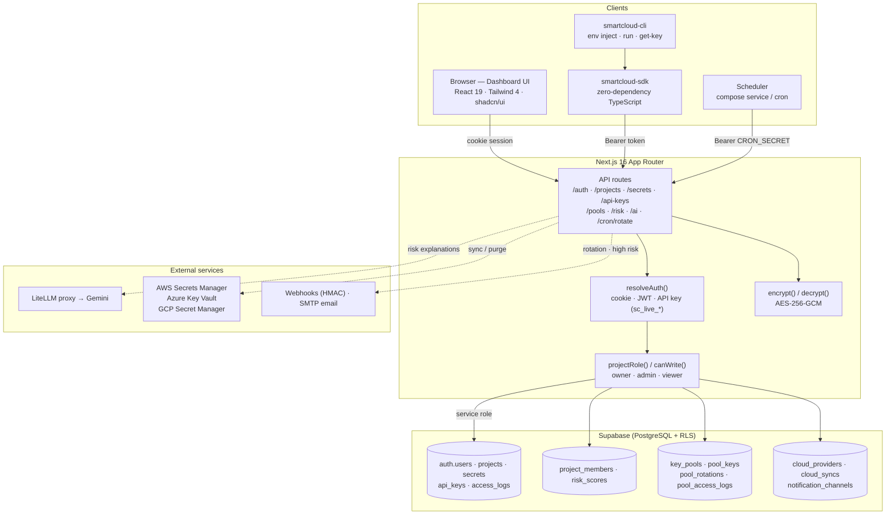
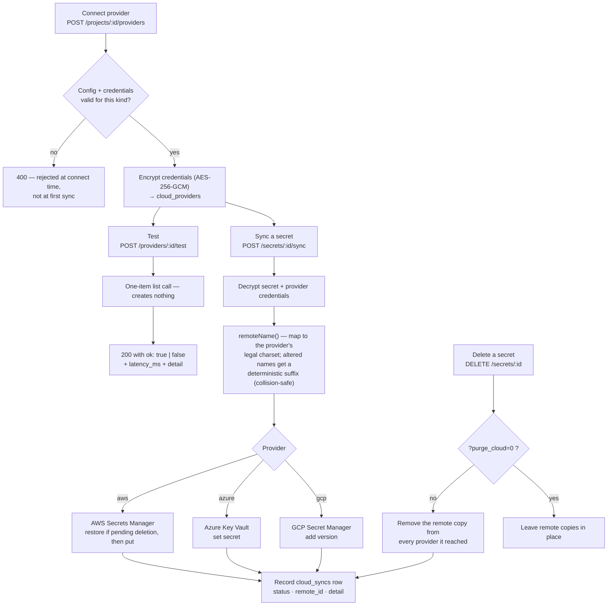
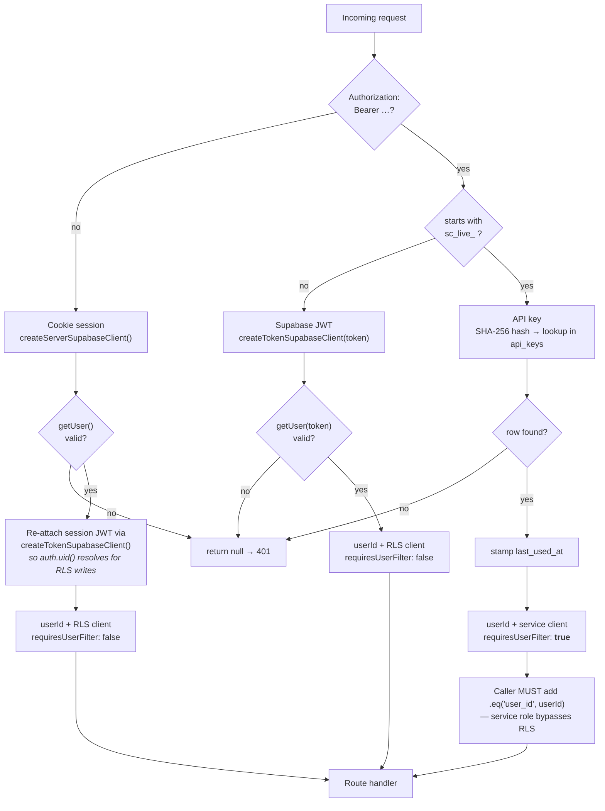
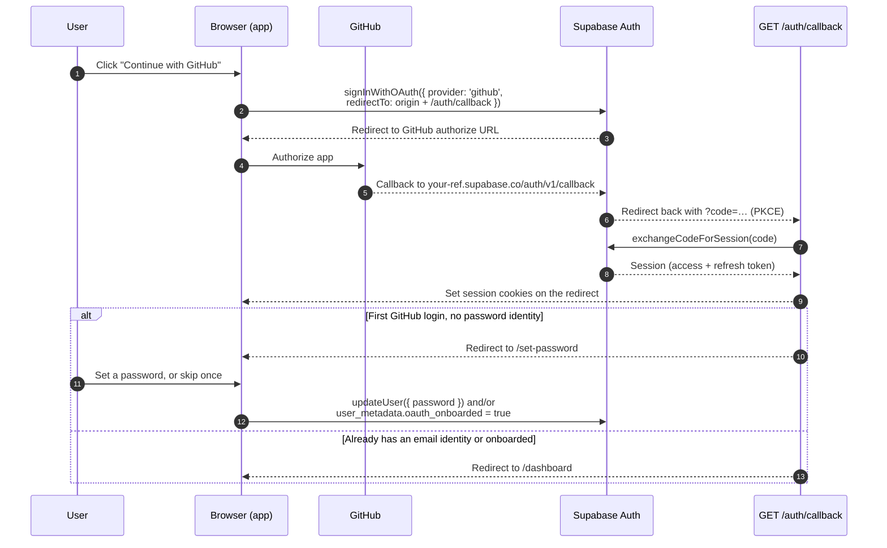
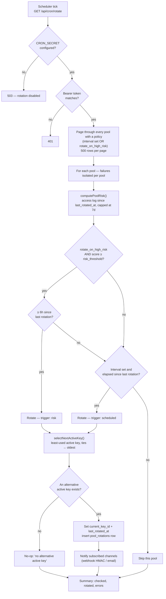
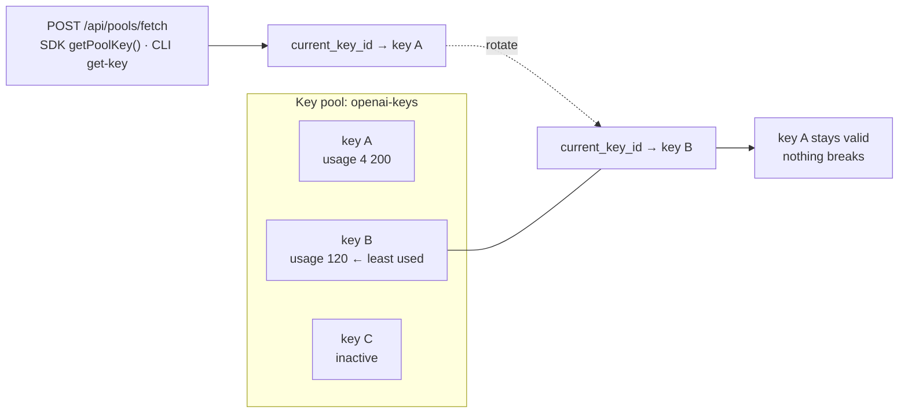
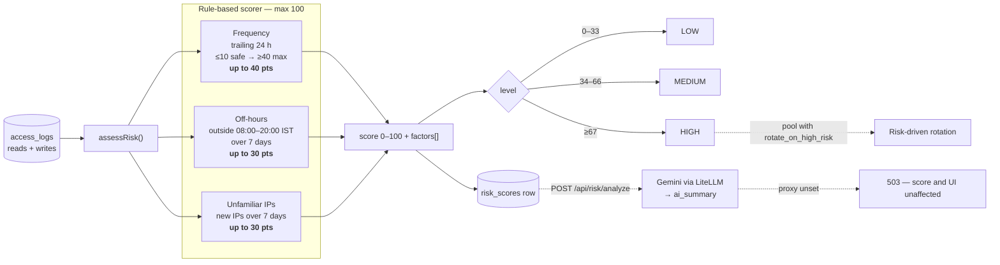

# SmartCloud Secrets Manager

A full-stack secrets management platform with AES-256-GCM encryption, role-based access, audit logging, and programmatic access via SDK and CLI.

Built with Next.js 16, React 19, Supabase (PostgreSQL + Auth + RLS), and TypeScript.

## Features

- **AES-256-GCM Encryption** — Secrets are encrypted server-side before storage. Plaintext is never persisted; encrypted bytes are never sent to the client.
- **Per-Project Secrets** — Organize secrets into projects (e.g., `production-api`, `staging-backend`).
- **AI-Based Risk Analysis** — A rule-based scorer (frequency, off-hours, unfamiliar IPs) grades each secret Low/Medium/High, with a plain-English explanation from Google Gemini via a LiteLLM proxy.
- **Key Pools** — pools of multiple interchangeable real keys (e.g. several OpenAI keys); one is served at a time and rotation switches to the least-used active key (manual, scheduled, or risk-driven). No value is generated and old keys stay valid, so rotation never breaks a consumer. Static secrets themselves are storage + risk analysis only.
- **Multi-Cloud Sync** — Push secrets out to AWS Secrets Manager, Azure Key Vault, or GCP Secret Manager through one unified adapter interface, with a one-click connection test, collision-safe remote naming, and cleanup of the remote copy when a secret is deleted.
- **RBAC** — Share projects with teammates as owner / admin / viewer, enforced by Supabase RLS.
- **Notifications** — Webhook (HMAC-signed) and email channels for rotation and high-risk events.
- **Reports** — Per-project CSV/print (PDF) security report with an access-activity timeline.
- **Dashboard UI** — shadcn/ui + soft-glass design system with light/dark themes, for managing projects, secrets, risk, rotation, cloud, team, and API keys.
- **Row-Level Security** — Supabase RLS ensures users only access projects they own or are a member of.
- **Audit Logging** — Every secret read/write is logged with user, IP, and timestamp.
- **API Keys** — Generate long-lived `sc_live_*` tokens for programmatic access (SHA-256 hashed, shown once).
- **TypeScript SDK** — Zero-dependency SDK (`smartcloud-sdk`) for fetching secrets and pool keys from any Node.js/Next.js project.
- **CLI Tool** — `smartcloud-cli` for terminal-based secret access, `env` injection, and process wrapping.
- **Three Auth Methods** — Cookie sessions (browser), Supabase JWT (Bearer token), and custom API keys.

## Architecture



## Project Structure

```
smartcloud/
├── src/
│   ├── app/
│   │   ├── (auth)/              # login, signup, change-password, set-password
│   │   ├── auth/callback/       # OAuth PKCE code exchange
│   │   ├── dashboard/
│   │   │   ├── api-keys/
│   │   │   └── projects/[projectId]/   # project workspace, nested:
│   │   │       ├── secrets/[secretId]/ #   secret detail + risk breakdown
│   │   │       ├── pools/[poolId]/     #   key pools + rotation history
│   │   │       ├── providers/          #   cloud providers
│   │   │       ├── members/            #   team + roles
│   │   │       ├── notifications/      #   webhook/email channels
│   │   │       └── report/             #   CSV/print security report
│   │   ├── api/                 # API routes
│   │   │   ├── auth/            # login, signup, logout, change-password
│   │   │   ├── projects/        # CRUD + members, channels, providers, report
│   │   │   ├── secrets/         # CRUD + fetch + fetch-all + sync
│   │   │   ├── pools/           # key pools, keys, rotate, fetch
│   │   │   ├── risk/            # score read, recompute, AI explanation
│   │   │   ├── ai/anomalies/    # AI anomaly summary over access_logs
│   │   │   ├── api-keys/        # Generate/revoke API keys
│   │   │   ├── cron/rotate/     # Scheduler tick (CRON_SECRET)
│   │   │   └── health/          # Health check
│   │   ├── globals.css          # Design tokens + soft-glass layer
│   │   └── layout.tsx           # Root layout (theme provider)
│   ├── components/
│   │   ├── ui/                  # shadcn/ui primitives (new-york)
│   │   ├── dashboard/           # app shell: sidebar, header, switcher, palette
│   │   ├── auth/ secrets/ pools/ cloud/ members/ notifications/ risk/ reports/
│   │   └── theme-provider.tsx   # next-themes runtime
│   ├── lib/
│   │   ├── auth.ts              # resolveAuth() — cookie, JWT, API key
│   │   ├── access.ts            # projectRole() / canWrite() — RBAC in app code
│   │   ├── encryption.ts        # AES-256-GCM encrypt/decrypt
│   │   ├── risk.ts              # Rule-based risk scorer
│   │   ├── ai.ts                # LiteLLM/Gemini client (cache + rate limit)
│   │   ├── pool.ts              # Key-pool selection ("least-used active")
│   │   ├── poolRotation.ts      # Rotation policy evaluation
│   │   ├── notify.ts            # Webhook (HMAC) + SMTP email channels
│   │   ├── cloud/               # aws.ts, azure.ts, gcp.ts + names/validate/sync
│   │   ├── types.ts             # TypeScript interfaces
│   │   └── supabase/
│   │       ├── client.ts        # Browser client
│   │       ├── server.ts        # Server client + token client
│   │       └── service.ts       # Service role client (bypasses RLS)
│   └── proxy.ts                 # Auth proxy (session refresh, route protection)
├── packages/
│   ├── sdk/                     # smartcloud-sdk — TypeScript SDK
│   └── cli/                     # smartcloud-cli — CLI tool
├── litellm/                     # LiteLLM proxy config + Dockerfile
├── supabase/
│   └── migrations/              # 001 → 009 (see "Set up Supabase" below)
├── tests/
│   ├── unit/                    # encryption, risk, pool, ai, cloud, datetime
│   └── integration/             # API route tests (mocked Supabase)
└── e2e/                         # Playwright smoke tests
```

## Getting Started

### Prerequisites

- Node.js >= 18
- A [Supabase](https://supabase.com) project

### 1. Clone and install

```bash
git clone <repo-url>
cd smartcloud
npm install
```

### 2. Set up Supabase

Run every migration file in `supabase/migrations/` in order (001 → 009) in the
Supabase SQL Editor:

1. `001_initial_schema.sql` — `projects`, `secrets`, `access_logs` + RLS
2. `002_api_keys.sql` — `api_keys` table + RLS
3. `003_risk_scores.sql` — risk scoring history
4. `004_rbac.sql` — `project_members`, role-aware RLS
5. `005_rotation.sql` — (superseded by 008; original per-secret rotation)
6. `006_cloud_providers.sql` — cloud providers + sync history
7. `007_risk_rotation_notifications.sql` — high-risk flag + notification channels
8. `008_key_pools.sql` — removes per-secret rotation; adds key pools (`key_pools`, `pool_keys`, `pool_rotations`, `pool_access_logs`)
9. `009_pool_usage_rpc.sql` — atomic `bump_pool_key_usage` (keeps "least-used" selection accurate under concurrent fetches)

### 3. Configure environment

Create a `.env` file:

```env
NEXT_PUBLIC_APP_URL=http://localhost:3000
NEXT_PUBLIC_SUPABASE_URL=https://your-project.supabase.co
NEXT_PUBLIC_SUPABASE_ANON_KEY=your-anon-key
SUPABASE_SERVICE_ROLE_KEY=your-service-role-key
ENCRYPTION_MASTER_KEY=your-64-char-hex-key
```

That is the minimum to run the app. AI risk explanations, key-pool rotation and
email notifications each need extra variables — see
[Environment Variables](#environment-variables) for the full list.

Generate an encryption key:

```bash
node -e "console.log(require('crypto').randomBytes(32).toString('hex'))"
```

### 4. Run development server

```bash
npm run dev
```

Open [http://localhost:3000](http://localhost:3000) to access the dashboard.

### 5. Build SDK and CLI

```bash
cd packages/sdk && npm run build
cd ../cli && npm run build
```

## API Reference

All endpoints accept/return JSON. Authentication via `Authorization: Bearer <token>` header (JWT or API key) or cookie session.

### Auth

| Method | Endpoint | Description |
|--------|----------|-------------|
| POST | `/api/auth/signup` | Create a new account |
| POST | `/api/auth/login` | Sign in, returns session with `access_token` |
| POST | `/api/auth/logout` | Sign out |
| POST | `/api/auth/change-password` | Update password |

### Projects

| Method | Endpoint | Description |
|--------|----------|-------------|
| GET | `/api/projects` | List all projects for the authenticated user |
| POST | `/api/projects` | Create a new project |
| GET | `/api/projects/:id` | Get project details |
| PUT | `/api/projects/:id` | Update project name/description |
| DELETE | `/api/projects/:id` | Delete project and all its secrets |

### Secrets

| Method | Endpoint | Description |
|--------|----------|-------------|
| POST | `/api/secrets` | Create a new encrypted secret |
| GET | `/api/secrets/:id` | Get secret metadata (no value) |
| PUT | `/api/secrets/:id` | Update secret value or description |
| DELETE | `/api/secrets/:id` | Delete a secret (also removes it from any cloud provider it reached; `?purge_cloud=0` to skip) |
| POST | `/api/secrets/fetch` | Fetch and decrypt a single secret by key name |
| POST | `/api/secrets/fetch-all` | Fetch and decrypt all secrets for a project |

**`POST /api/secrets/fetch`** — Request body:
```json
{ "project_id": "uuid", "key_name": "DATABASE_URL" }
```

**`POST /api/secrets/fetch-all`** — Request body:
```json
{ "project_id": "uuid" }
```

### Key pools

| Method | Endpoint | Description |
|--------|----------|-------------|
| GET | `/api/pools?project_id=` | List a project's key pools |
| POST | `/api/pools` | Create a key pool |
| GET | `/api/pools/:poolId` | Pool detail: keys (metadata only), rotation history, live risk |
| PATCH | `/api/pools/:poolId` | Update rotation policy (`rotation_interval_days`, `rotate_on_high_risk`, `risk_threshold`) |
| DELETE | `/api/pools/:poolId` | Delete the pool and all its keys |
| POST | `/api/pools/:poolId/keys` | Add a real key to the pool |
| PATCH | `/api/pools/:poolId/keys/:keyId` | Activate / deactivate a key |
| DELETE | `/api/pools/:poolId/keys/:keyId` | Remove a key from the pool |
| POST | `/api/pools/:poolId/rotate` | Rotate now — switch to the least-used active key |
| POST | `/api/pools/fetch` | Fetch the pool's currently served key (used by SDK/CLI) |
| GET | `/api/cron/rotate` | Scheduler tick — requires `Authorization: Bearer $CRON_SECRET` |

### Cloud providers

| Method | Endpoint | Description |
|--------|----------|-------------|
| GET | `/api/projects/:projectId/providers` | List connected providers (credentials never returned) |
| POST | `/api/projects/:projectId/providers` | Connect a provider (config + credentials validated per kind) |
| PATCH | `/api/projects/:projectId/providers/:providerId` | Update label/config or rotate credentials |
| DELETE | `/api/projects/:projectId/providers/:providerId` | Disconnect a provider |
| POST | `/api/projects/:projectId/providers/:providerId/test` | Verify the credentials reach the provider |
| POST | `/api/secrets/:secretId/sync` | Push a secret to one provider (`{ provider_id }`) or all |
| GET | `/api/secrets/:secretId/sync` | Recent sync history for the secret |

**`POST /api/projects/:projectId/providers/:providerId/test`** — returns `200`
either way; `ok` distinguishes a reachable provider from a rejected one:
```json
{ "provider_id": "uuid", "provider": "aws", "ok": false, "latency_ms": 412,
  "detail": "The security token included in the request is invalid." }
```

### Risk & AI

| Method | Endpoint | Description |
|--------|----------|-------------|
| GET | `/api/risk?project_id=` | Latest risk score per secret in the project |
| GET | `/api/risk?project_id=&secret_id=` | Full score history for one secret |
| POST | `/api/risk/recompute` | Recompute the rule-based score for one secret (`{ project_id, secret_id }`) or every secret in the project (omit `secret_id`) |
| POST | `/api/risk/analyze` | Generate and store an AI explanation for a secret's latest score (`{ project_id, secret_id }`) — `503` when AI is unconfigured |
| POST | `/api/ai/anomalies` | AI summary of suspicious patterns across the project's recent access logs (`{ project_id }`) — `503` when AI is unconfigured |

### Team (RBAC)

| Method | Endpoint | Description |
|--------|----------|-------------|
| GET | `/api/projects/:projectId/members` | List members and the owner, with emails |
| POST | `/api/projects/:projectId/members` | Invite a member by email as `admin` or `viewer` |
| PATCH | `/api/projects/:projectId/members/:memberId` | Change a member's role |
| DELETE | `/api/projects/:projectId/members/:memberId` | Remove a member |

### Notification channels

| Method | Endpoint | Description |
|--------|----------|-------------|
| GET | `/api/projects/:projectId/channels` | List channels (signing secret never returned) |
| POST | `/api/projects/:projectId/channels` | Add an `email` or `webhook` channel for the `rotation` / `high_risk` events |
| PATCH | `/api/projects/:projectId/channels/:channelId` | Update target, events, or active flag |
| DELETE | `/api/projects/:projectId/channels/:channelId` | Remove a channel |
| POST | `/api/projects/:projectId/channels/:channelId/test` | Send a test notification through the channel |

### Reports

| Method | Endpoint | Description |
|--------|----------|-------------|
| GET | `/api/projects/:projectId/report?format=json` | Per-secret security report (risk level + access counts) |
| GET | `/api/projects/:projectId/report?format=csv` | Same report as a CSV download |

### API Keys

| Method | Endpoint | Description |
|--------|----------|-------------|
| GET | `/api/api-keys` | List all API keys (prefix only) |
| POST | `/api/api-keys` | Generate a new API key (plaintext shown once) |
| DELETE | `/api/api-keys/:id` | Revoke an API key |

### Health

| Method | Endpoint | Description |
|--------|----------|-------------|
| GET | `/api/health` | Health check (`{ status: "ok", timestamp }`) |

## SDK Usage

Install the SDK in your project:

```bash
npm install smartcloud-sdk
```

Or install from local path during development:

```bash
npm install ../../smartcloud/packages/sdk
```

### Configuration

Add to your project's `.env`:

```env
SMARTCLOUD_URL=http://localhost:3000
SMARTCLOUD_TOKEN=sc_live_your_api_key_here
SMARTCLOUD_PROJECT=your-project-uuid
```

### Fetch all secrets

```typescript
import { SmartCloudClient } from 'smartcloud-sdk'

const client = new SmartCloudClient({
  baseUrl: process.env.SMARTCLOUD_URL!,
  accessToken: process.env.SMARTCLOUD_TOKEN!,
})

// Returns Record<string, string>
const secrets = await client.getSecrets(process.env.SMARTCLOUD_PROJECT!)
console.log(secrets.DATABASE_URL)
```

### Fetch a single secret

```typescript
const value = await client.getSecret(projectId, 'DATABASE_URL')
```

### Fetch with metadata

```typescript
const secret = await client.getSecretWithMetadata(projectId, 'DATABASE_URL')
// { key_name, value, project_id, secret_id, fetched_at }
```

### Fetch a key pool's active key

```typescript
const apiKey = await client.getPoolKey(projectId, 'openai-keys')
```

### List projects

```typescript
const projects = await client.listProjects()
```

### Email/password authentication

```typescript
const client = new SmartCloudClient({
  baseUrl: process.env.SMARTCLOUD_URL!,
  email: 'user@example.com',
  password: 'password',
})

// login() is called automatically on first request, or manually:
await client.login()
```

## CLI Usage

Build and link the CLI:

```bash
cd packages/cli
npm run build
npm link
```

### Commands

```bash
# Configure base URL
smartcloud config --base-url http://localhost:3000

# Login (stores JWT in ~/.smartcloud/auth.json)
smartcloud login -e user@example.com

# List projects
smartcloud projects

# Fetch a single secret
smartcloud get-secret -p <project-id> -k DATABASE_URL

# Fetch a key pool's currently active key
smartcloud get-key -p <project-id> -n openai-keys

# Dump all secrets as .env format (-f shell for export lines)
smartcloud env -p <project-id>

# Run a command with secrets injected as env vars
smartcloud run -p <project-id> -- node server.js
```

`smartcloud config --default-project <project-id>` sets a default so `-p` can be
omitted.

## Multi-Cloud Sync

Connect a project to AWS, Azure, or GCP (Dashboard → project → **Cloud**) and
push SmartCloud secrets out to the provider's secret store. Credentials are
encrypted with the AES-256-GCM master key before storage and are never returned
to the browser.

Use **Test** on a provider card to verify the stored credentials actually reach
the provider — a one-item list call that creates nothing. Without it, a typo in a
key or a missing IAM permission stays invisible until the first real sync fails.

Deleting a secret also removes it from every provider it reached, so a
credential SmartCloud no longer knows about doesn't outlive it in a vault
(opt out per request with `?purge_cloud=0`).

Remote names are mapped to each provider's legal charset. The mapping is
collision-safe: names needing no change pass through as-is, and any name that
had to be altered gets a short deterministic suffix, so `MY_KEY` and `MY-KEY`
can never overwrite each other in a vault that forbids underscores.



### AWS Secrets Manager

Create an IAM user (or role) with `secretsmanager:CreateSecret`,
`PutSecretValue`, `GetSecretValue`, `DeleteSecret`, `RestoreSecret`, and
`ListSecrets` (the last two power deleted-secret recovery and the connection
test). Connect with:

- **Region** (e.g. `us-east-1`)
- **Access Key ID** / **Secret Access Key**

### Azure Key Vault

Register an app (service principal) and grant it the *Key Vault Secrets Officer*
role on the vault (it covers list, set, get and delete). Connect with:

- **Vault URL** (`https://<vault>.vault.azure.net`)
- **Tenant ID** / **Client ID** / **Client Secret**

### GCP Secret Manager

Create a service account with the *Secret Manager Admin* role and download a
JSON key. Connect with:

- **Project ID**
- **Service Account Email** / **Private Key** (the `private_key` field)

## Database Schema

### projects
| Column | Type | Description |
|--------|------|-------------|
| id | UUID | Primary key |
| user_id | UUID | Owner (references auth.users) |
| name | TEXT | Project name |
| description | TEXT | Optional description |
| created_at | TIMESTAMPTZ | Creation timestamp |
| updated_at | TIMESTAMPTZ | Auto-updated on change |

### secrets
| Column | Type | Description |
|--------|------|-------------|
| id | UUID | Primary key |
| project_id | UUID | Parent project |
| user_id | UUID | Owner |
| key_name | TEXT | Unique within project, auto-uppercased |
| encrypted_value | TEXT | Base64 AES-256-GCM ciphertext |
| iv | TEXT | Base64, 12-byte random initialization vector |
| auth_tag | TEXT | Base64, 16-byte GCM authentication tag |
| description | TEXT | Optional description |
| created_at / updated_at | TIMESTAMPTZ | Timestamps (`updated_at` auto-updated) |

### api_keys
| Column | Type | Description |
|--------|------|-------------|
| id | UUID | Primary key |
| user_id | UUID | Owner |
| name | TEXT | User-friendly label |
| key_hash | TEXT | SHA-256 hash of the plaintext key |
| key_prefix | TEXT | First 16 chars for identification |
| last_used_at | TIMESTAMPTZ | Updated on each API call |

### access_logs
| Column | Type | Description |
|--------|------|-------------|
| id | UUID | Primary key |
| secret_id | UUID | Which secret was accessed |
| user_id | UUID | Who accessed it |
| project_id | UUID | Project context |
| key_name | TEXT | Secret key name |
| action | TEXT | READ, CREATE, UPDATE, or DELETE |
| ip_address | TEXT | Client IP |
| accessed_at | TIMESTAMPTZ | Timestamp |

### project_members (004)
| Column | Type | Description |
|--------|------|-------------|
| project_id / user_id | UUID | Membership pair (unique together) |
| role | project_role | `owner` \| `admin` \| `viewer` |
| invited_by | UUID | Who added them |

The `current_project_role(pid)` SQL function (plpgsql, `SECURITY DEFINER`, pinned
`search_path`) backs every member-aware RLS policy.

### risk_scores (003)
| Column | Type | Description |
|--------|------|-------------|
| secret_id / project_id / user_id | UUID | Scope |
| score | INT | 0–100, rule-based |
| level | TEXT | `LOW` \| `MEDIUM` \| `HIGH` |
| factors | JSONB | Explainable per-rule breakdown |
| sample_size | INT | Access logs considered |
| ai_summary | TEXT | Plain-English explanation (filled by `/api/risk/analyze`) |
| window_start / window_end / computed_at | TIMESTAMPTZ | Evidence window + run time |

### cloud_providers / cloud_syncs (006)
| Table | Notable columns |
|-------|-----------------|
| `cloud_providers` | `provider` (`aws`\|`azure`\|`gcp`), `name`, `config` JSONB (non-secret), `encrypted_credentials` + `iv` + `auth_tag` (AES-256-GCM) |
| `cloud_syncs` | `provider_id`, `secret_id`, `status` (`success`\|`failed`), `remote_id` (ARN / secret id), `detail`, `synced_at` |

### notification_channels (007)
| Column | Type | Description |
|--------|------|-------------|
| type | TEXT | `email` or `webhook` |
| target | TEXT | Email address or webhook URL |
| events | TEXT[] | Subscribed events (`rotation`, `high_risk`) |
| secret | TEXT | Webhook HMAC signing secret (never returned by the API) |
| active | BOOLEAN | Toggle without deleting |

### key_pools / pool_keys / pool_rotations / pool_access_logs (008)
| Table | Notable columns |
|-------|-----------------|
| `key_pools` | `name` (unique per project), `rotation_interval_days` (NULL = no schedule), `rotate_on_high_risk`, `risk_threshold` (default 67), `current_key_id`, `last_rotated_at` |
| `pool_keys` | `label`, `encrypted_value` + `iv` + `auth_tag`, `active`, `usage_count`, `last_used_at` |
| `pool_rotations` | `from_key_id`, `to_key_id`, `trigger` (`manual`\|`scheduled`\|`risk`), `reason`, `rotated_at` |
| `pool_access_logs` | Pool fetch log feeding the risk engine (same shape as `access_logs`) |

Migration `009` adds the `bump_pool_key_usage` RPC so `usage_count` increments
atomically — "least-used active key" stays accurate under concurrent fetches.

## Security

- **Encryption**: AES-256-GCM with a 12-byte random IV per encryption. The 16-byte authentication tag makes tampering detectable — a modified ciphertext fails to decrypt rather than yielding garbage. Master key stored as an environment variable, never in the database. Secret values, pool keys, and cloud provider credentials all use the same envelope.
- **API Keys**: Plaintext shown once at creation. Stored as SHA-256 hash. Prefixed with `sc_live_` for identification.
- **Row-Level Security**: All tables have Supabase RLS enabled. Ownership-scoped tables use `auth.uid() = user_id`; project-scoped tables (secrets, pools, providers, channels, members) use the member-aware `current_project_role()` function, so `viewer` reads but only `owner`/`admin` writes.
- **Service role**: API routes use the service-role client (which bypasses RLS) for writes, because RLS's `auth.uid()` is not forwarded on Bearer-token and API-key requests. Authorization is therefore enforced in app code first: every such route resolves the caller's role via `projectRole()`/`canWrite()` (`src/lib/access.ts`) — the same rules as the SQL policies — and API-key auth additionally sets `requiresUserFilter`, forcing an explicit `.eq('user_id', userId)` on queries.
- **Proxy**: The auth proxy (`src/proxy.ts`, formerly the `middleware` file convention) refreshes sessions and protects dashboard routes. API routes are excluded via the `matcher` to prevent session poisoning for Bearer token auth.
- **Response Sanitization**: `encrypted_value`, `iv`, and `auth_tag` are never returned in API responses. Only decrypted plaintext is sent to authorized clients.

## Authentication Flow

`resolveAuth(request)` (`src/lib/auth.ts`) resolves all three methods to a single
`{ userId, supabase, requiresUserFilter }` result, so every route handles auth
identically:



1. **Browser (cookie)**: `createServerSupabaseClient()` reads session cookies; Supabase refreshes the JWT automatically. The validated session's token is then re-attached via a token client, because the plain SSR cookie client can fail to forward it to PostgREST on writes — leaving `auth.uid()` null and tripping RLS `WITH CHECK`.
2. **Supabase JWT (Bearer)**: `createTokenSupabaseClient(token)` sends the token in the `Authorization` header; `getUser(token)` validates directly with Supabase Auth.
3. **API Key (Bearer `sc_live_*`)**: SHA-256 hashed and looked up in `api_keys` via the service client. Returns a service client with `requiresUserFilter: true` — callers must add `.eq('user_id', userId)` to queries, since the service role bypasses RLS.

## GitHub OAuth Login

The dashboard supports "Continue with GitHub" alongside email/password, via
Supabase Auth. No app secrets are needed — GitHub credentials live in Supabase.

**Setup (one-time):**

1. **GitHub → Settings → Developer settings → OAuth Apps → New OAuth App**
   - *Homepage URL*: your app URL (e.g. `http://localhost:3000`)
   - *Authorization callback URL*: `https://<project-ref>.supabase.co/auth/v1/callback`
     (this is Supabase's callback, shown on the provider page below — **not** the app's `/auth/callback`)
   - Copy the **Client ID** and generate a **Client Secret**.
2. **Supabase Dashboard → Authentication → Providers → GitHub**: enable it and
   paste the Client ID / Secret.
3. **Supabase Dashboard → Authentication → URL Configuration**: set the **Site URL**
   and add `http://localhost:3000/auth/callback` (and your production
   `.../auth/callback`) to **Redirect URLs**.

**Flow:**



OAuth users get a normal `auth.users` row, so projects and secrets scope to them
like any other account.

**Password onboarding:** a first-time GitHub account has no password, so the
callback routes it to `/set-password` where the user can set one (so they can
still sign in by email if GitHub is unavailable) or skip once. The choice is
remembered in `user_metadata.oauth_onboarded`, and accounts that already have an
`email` identity (e.g. email-first users who later link GitHub) are never
prompted. A skipped user can still add a password later via **Change password**
(Supabase's `updateUser` needs no current password for an active session).

## Testing

```bash
# Run all tests
npm test

# Watch mode
npm run test:watch

# With coverage
npm run test:coverage
```

Tests use Vitest with mocked Supabase clients and real AES-256-GCM encryption (via `@/lib/encryption`).

End-to-end smoke tests use Playwright:

```bash
npx playwright install chromium   # first run only
npm run test:e2e
```

## Tech Stack

| Layer | Technology |
|-------|-----------|
| Framework | Next.js 16 (App Router) |
| Frontend | React 19, Tailwind CSS 4, shadcn/ui (new-york), next-themes, Recharts |
| Database | Supabase (PostgreSQL + RLS) |
| Auth | Supabase Auth (email/password + GitHub OAuth) + custom API keys |
| Encryption | Node.js crypto (AES-256-GCM) |
| AI | Google Gemini via a LiteLLM proxy |
| Cloud | AWS/Azure/GCP secret-store SDKs |
| Email | Nodemailer (SMTP) |
| Testing | Vitest (unit + integration), Playwright (e2e) |
| SDK | TypeScript, zero dependencies |
| CLI | Commander.js |

## Environment Variables

| Variable | Required | Description |
|----------|----------|-------------|
| `NEXT_PUBLIC_APP_URL` | Recommended | Canonical public URL of the app (e.g. `https://smartcloud.example.com`). Used to build OAuth redirect URLs; falls back to the request/browser origin when unset. Set it in production. |
| `NEXT_PUBLIC_SUPABASE_URL` | Yes | Supabase project URL |
| `NEXT_PUBLIC_SUPABASE_ANON_KEY` | Yes | Supabase anonymous key |
| `SUPABASE_SERVICE_ROLE_KEY` | Yes | Supabase service role key (server-only) |
| `ENCRYPTION_MASTER_KEY` | Yes | 64-char hex string (32 bytes) for AES-256-GCM |
| `LITELLM_BASE_URL` | No | LiteLLM proxy URL for AI risk analysis (default `http://localhost:4000`) |
| `LITELLM_MASTER_KEY` | No | Master key for the LiteLLM proxy; AI features are disabled when unset |
| `GEMINI_API_KEY` | No | Google Gemini key, consumed by the LiteLLM proxy (see `litellm/config.yaml`) |
| `LITELLM_MODEL` | No | Gemini model the app requests via the proxy, full LiteLLM string (default `gemini/gemini-3.5-flash-lite`) |
| `AI_MAX_TOKENS` | No | Max tokens per AI response (default `300`) |
| `AI_MAX_CALLS_PER_MIN` | No | Per-process AI rate limit (default `30`) |
| `AI_CACHE_TTL_MS` | No | How long an AI response is reused (default `3600000`, 1 h) |
| `SMTP_HOST` / `SMTP_USER` / `SMTP_PASS` | For email | Email notification channels are disabled unless all three are set |
| `SMTP_PORT` | No | SMTP port (default `587`) |
| `SMTP_SECURE` | No | `true` to force TLS-on-connect; defaults to `true` only for port `465` |
| `NOTIFY_EMAIL_FROM` | No | From-address for notification email (falls back to `SMTP_USER`) |
| `CRON_SECRET` | For rotation | Bearer token the scheduler presents to `/api/cron/rotate`. **Scheduled and risk-driven rotation do not run without it.** |
| `ROTATE_INTERVAL_SECONDS` | No | How often the `scheduler` container ticks rotation (default `3600`) |
| `ROTATE_URL` | No | Endpoint the scheduler calls (default `http://web:3000/api/cron/rotate`) |

### Rotation scheduling

Manual rotation ("Rotate now") works out of the box. **Scheduled and
risk-driven rotation need a ticker** — something that periodically calls:

```
GET /api/cron/rotate
Authorization: Bearer $CRON_SECRET
```

`docker-compose.yml` ships a `scheduler` service that does exactly this, hourly
by default, over the internal network. Set `CRON_SECRET` and it runs; leave it
unset and the scheduler logs `rotation is DISABLED` and idles — in which case
every rotation interval and every "rotate on high risk" toggle is inert.

The endpoint is idempotent: a pool rotates only when its own interval has
genuinely elapsed or its risk crossed its own threshold, so the tick interval
controls responsiveness, not correctness. Any scheduler works — systemd timer,
Supabase `pg_cron` + `pg_net`, GitHub Actions, or Vercel Cron (`vercel.json`,
which applies only to a Vercel deployment).

What one tick does (`src/app/api/cron/rotate/route.ts` + `shouldRotate()`):



Risk-driven rotation measures a pool's risk over its access log **since the last
rotation** (capped at 7 days), so the score decays once the pool has moved off
the suspicious key instead of staying pinned high; a 6-hour cooldown additionally
bounds how often a pool under sustained abuse can rotate and notify. Manual
"Rotate now" runs the same `rotatePool()` path and notifies identically — only
the `trigger` recorded in `pool_rotations` differs.

Because every key in a pool is a real, already-valid credential, rotation only
changes *which* key is served — a consumer holding the previous one keeps working:



### Risk scoring pipeline

The number is deterministic and rule-based (`src/lib/risk.ts`); the AI only ever
explains a score it did not compute, so an unavailable proxy never changes a
risk verdict:



### AI risk analysis (LiteLLM + Gemini)

The AI layer adds a plain-English explanation on top of that score, served by
Google Gemini behind a [LiteLLM](https://docs.litellm.ai) proxy:

```bash
pip install 'litellm[proxy]'
export GEMINI_API_KEY=your_free_gemini_key
export LITELLM_MASTER_KEY=sk-smartcloud-local
litellm --config litellm/config.yaml --port 4000
```

Then set `LITELLM_MASTER_KEY` (and optionally `LITELLM_BASE_URL`) in the app's
`.env`. If the proxy is not configured, AI endpoints return `503` and the rest
of the app works unchanged.

## License

MIT
